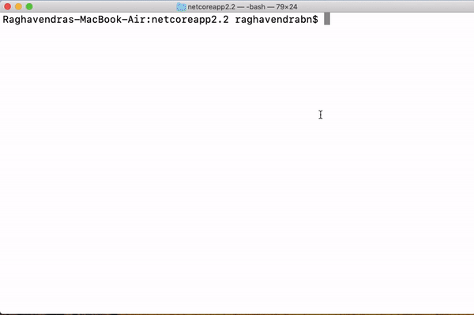

# Check Password Strength

This repository contains an asp.net core library, console application, test and Web API projects.

## CheckPasswordStrength Library 

CheckStrength method of the library accepts password as string and returns json object, which consists of password entropy bits, iscommonpassword bool and number of times the password has appeared in breaches.

```json
{"IsCommonPassword":true,"EntropyBits":28.7,"PwnedCount":3730471}
```

### Calculating Entropy Bits

* Password's entropy is used to determine how unpredictable a password is. Entropy is calculated by finding an entropy per character, which is a log base 2 of the number of characters in the character set used, multiplied by the number by the number of characters in the password itself along with character frequency analysis.    
*  E = Log2(R)*L, 

    R = *Pool of unique characters*<br/>  
    L = *Length of password*<br/>   
    Log2(R)*L = *Entropy bits* 
* Password strength is categorized as 
    
     EntropyBits <= 28 - *very weak*<br/>  
     EntropyBits <= 36 - *weak*<br/>  
     EntropyBits <= 60 - *fairly strong*<br/>  
     EntropyBits <= 128 - *strong*<br/>  
     EntropyBits > 128 - *very strong*<br/>

```csharp

            double charpool = Math.Log(CalculateCharPool(password)) / Math.Log(2.0);

```

### Check if password is common

* Very basic compression algorithm is used, if first character is in upper case then copy N letters from previous word. 
* A variable of type string is assigned with fixed set of characters for calculation.


### Finding number of times the password appeared in data breach.

* SHA1 hash of given password will be calculated and first 5 characters are posted to https://api.pwnedpasswords.com/range/ to get breach count.
* CheckIfPwned uses asp.net core HTTPClient factory to configure and manage instances.

```csharp


            var request = new HttpRequestMessage(HttpMethod.Get, "https://api.pwnedpasswords.com/range/" + prefixofSha1);
            var client = _clientFactory.CreateClient();
            try
            {
                var response = await client.SendAsync(request);

                if (response.IsSuccessStatusCode)
                {
          
                    var PwnedFrequency = await Contains(response.Content, suffixofSha1);
                    var PwnedCount = (PwnedFrequency >= 1);
                    return PwnedFrequency;

                }
            }
```

## CheckPasswordStrength.Test

* Tests if an argument exception is thrown, when null is passed.

```csharp

 public void DetermineStrength_WhenNullValues_GetArgumentException()
        {
            DetermineStrengthService service = GetClient();

            Assert.ThrowsAsync<ArgumentException>(async () => await service.CheckStrength(null));

        }
```
* Tests if method returns true if a common password is passed.

```csharp
 [Fact]
        public async Task DetermineStrength_WhenCommonPassword_ReturnTrue()
        {
            DetermineStrengthService service = GetClient();

            var commonPassword = "password";

            var result = await service.CheckStrength(commonPassword);
            Results value = JsonConvert.DeserializeObject<Results>(result);

            Assert.True(value.IsCommonPassword);

        }
```
* Tests if entropy is greater than 128 bits, when a very strong password is passed.

```csharp
 public async Task DetermineStrength_WhenVeryStrongPassword_ReturnEntropyBitRange()
        {
            DetermineStrengthService service = GetClient();

            var verystrongPassword = "jfQ0iF6S5GTNuZuhg/+/0nc9LmrDVGKEBo0nprdR3HXkFneVzen6GcrWBwUf5aMCkzKeM8ck341aLCvrijsmng==";

            var result = await service.CheckStrength(verystrongPassword);
            Results value = JsonConvert.DeserializeObject<Results>(result);

            Assert.True(value.EntropyBits > 128);

        }
```

* Tests if 0 is returned, when unbreachable password is passed.

```csharp
 [Fact]
        public async Task DetermineStrength_WhenBreachedPassword_ReturnZero()
        {
            DetermineStrengthService service = GetClient();

            var weakPassword = "XmZvZ4qDLa1erY9+elJtsSpWkndk58nzSfWJDi18HOKsb4Z4wo2XD+/qPXP2Eo+HmzMM10hlZR2Sf9apMNCYyA==";

            var result = await service.CheckStrength(weakPassword);
            Results value = JsonConvert.DeserializeObject<Results>(result);

            Assert.True(value.PwnedCount == 0);

        }
```
* Many such cases are tested.

## CheckPasswordStrengthConsole

### Getting started

Clone the repository to your local directory 

```powershell

git clone https://github.com/raghav-xxB/dpe-CheckPasswordStrength.git

```
Navigate to the project's root and build

```powershell

dotnet build

```
Execute the CheckPasswordConsole.dll 

```powershell

dotnet CheckPasswordConsole.dll

```
## Demo


## CheckPasswordStrength.API 
* This project is to test the service layer integration with asp.net core web API.
* Run the project and post the password in the request body.
# References 
[Password Entropy Concept](https://www.pleacher.com/mp/mlessons/algebra/entropy2.html)<br/>
[Character Frequency Analysis](https://reusablesec.blogspot.com/2009/05/character-frequency-analysis-info.html)
[Tony Hunt's Blog](https://www.troyhunt.com/authentication-and-the-have-i-been-pwned-api/)
[Andrew Locks PwnedPassword](https://github.com/andrewlock/PwnedPasswords)
